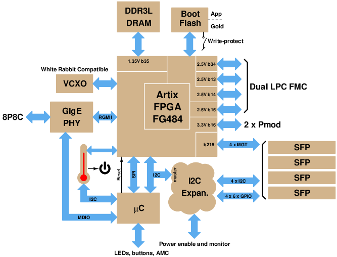
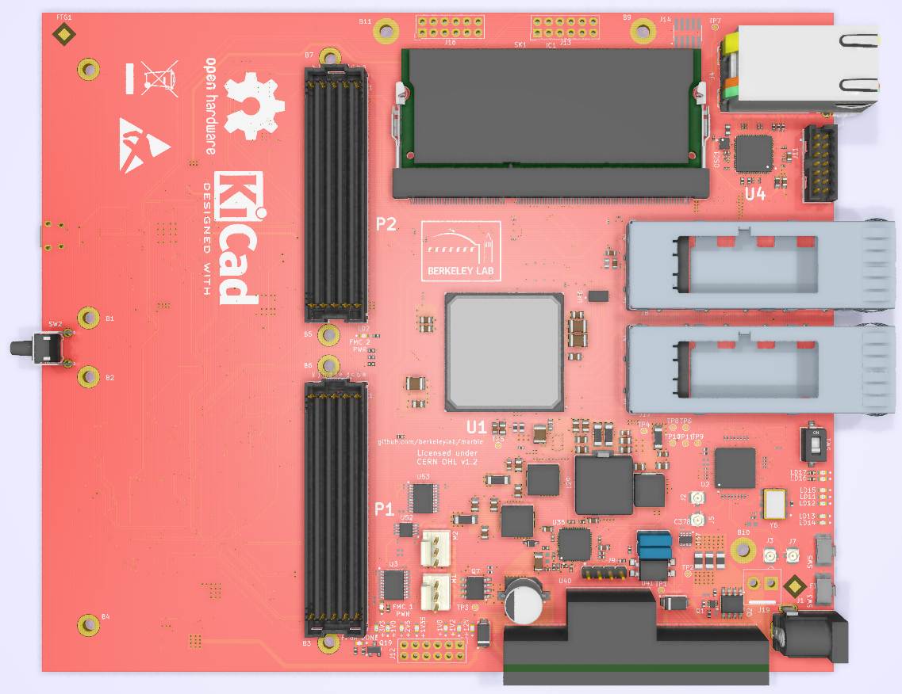

# Marble board

LBNL-Creotech collaboration: Dual FMC (LPC) NAD/AMC Carrier

A general purpose carrier board, sized to satisfy needs of some BPM and LLRF applications

## Original concept:

## [Specifications](specs.md)

## (Almost) Reality:

## Tools

The schematic/layout tool used is [KiCad EDA](http://www.kicad-pcb.org/)
version 5.1.2.  Other versions will very likely either not read the files
in this repo, or will save files that are not compatible with
collaborators' reference installations.
We also make use of [KiBoM](https://github.com/SchrodingersGat/KiBoM).

Note: Electrical Rules Checker reports 10 errors and 11  warnings. All of them are caused by errors in the library models. In order to remove them, the corresponding ERC settings should be deactivated (for errors: Output pin <-> Output pin, Power output pin <-> Power output pin, Power output pin <-> Output pin, Open collector <-> Output pin, and for warnings: Power output pin <-> Bidirectional pin).  

## Major Parts

* U1: Xilinx [XC7A100T-2FGG484](https://www.xilinx.com/products/silicon-devices/fpga/artix-7.html) FPGA (see note)
* U2: NXP [LPC1776FET180](https://www.nxp.com/products/processors-and-microcontrollers/arm-based-processors-and-mcus/lpc-cortex-m-mcus/lpc1700-cortex-m3:MC_1403790745385#/) Microcontroller
* U3: Micron [MT41K512M16HA](https://www.micron.com/products/dram/ddr3-sdram/part-catalog/mt41k512m16ha-125) or similar DDR3 x16 memory up to 8Gb
* U4: Marvell [88E1512](https://www.marvell.com/documents/eoxwrbluvwybgxvagkkf/) Ethernet PHY
* U20: TI [CDCM61004](http://www.ti.com/product/CDCM61004) Clock Generator
* U23: FTDI [FT4232H-56Q](https://www.ftdichip.com/Products/ICs/FT4232H.htm) USB interface
* U35: Maxlinear [XRP7724](https://www.maxlinear.com/product/power-management/universal-pmics/universal-pmics/xrp7724) Quad PWM Power Controller
* Y2: Mercury [VM53S3-25.000](https://docs-apac.rs-online.com/webdocs/151c/0900766b8151cb85.pdf) 25 MHz VCTCXO

Note: U1 is compatible with XC7A35T through XC7A200T; need XC7A75T or larger
to get all User I/O of dual-LPC-FMC

## Xilinx constrain file

Somewhat specialized tool for creating an xdc file for the Marble board, based on a netlist file exported from KiCad.
In the KiCad (version 5.1.x) schematic GUI (eeschema): 
* use menu picks Tools / Generate Netlist File
* OrcadPCB2 tab / Generate Netlist / Save
* result shows up as AMC_FMC_Carrier-PcbDoc.net
* Finally from the command line run "python3 netlist_to_xdc AMC_FMC_Carrier-PcbDoc.net"
* result shows up as Marble.xdc

