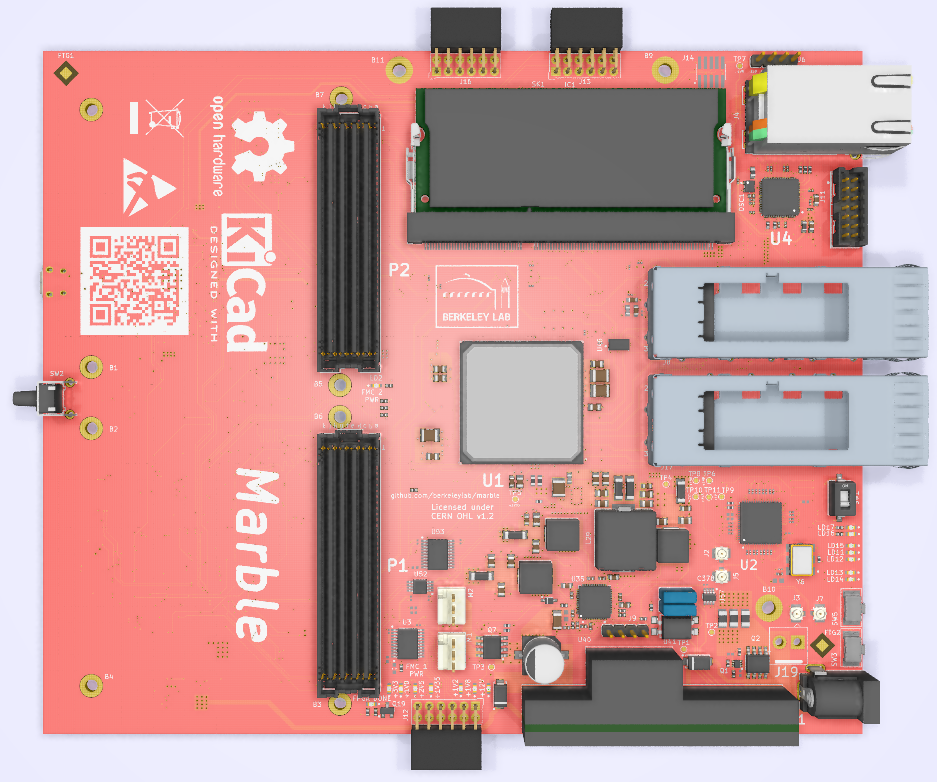

# Marble board

LBNL: Dual FMC (HPC & LPC) NAD/AMC Carrier

A general purpose carrier board, sized to satisfy needs of some BPM and LLRF applications

Status: under development

## Tools

The schematic/layout tool used is [KiCad EDA](http://www.kicad-pcb.org/)
version 5.1.6.  Other versions will very likely either not read the files
in this repo, or will save files that are not compatible with
collaborators' reference installations.
We also make use of [KiBoM](https://github.com/SchrodingersGat/KiBoM).

## Major Parts

* U1: Xilinx [XC7K160T-FFG676](https://www.xilinx.com/products/silicon-devices/fpga/kintex-7.html) FPGA
* SK1: 204-pin [DDR3](https://en.wikipedia.org/wiki/DDR3_SDRAM) [SO-DIMM](https://en.wikipedia.org/wiki/SO-DIMM)
* U2: ST [STM32L083VZT](https://www.st.com/resource/en/datasheet/stm32l083vz.pdf) Microcontroller
* U4: Marvell [88E1512](https://www.marvell.com/documents/eoxwrbluvwybgxvagkkf/) Ethernet PHY
* U20: TI [CDCM61004](http://www.ti.com/product/CDCM61004) Clock Generator
* U23: FTDI [FT4232H-56Q](https://www.ftdichip.com/Products/ICs/FT4232H.htm) USB interface
* U35: Maxlinear [XRP7724](https://www.maxlinear.com/product/power-management/universal-pmics/universal-pmics/xrp7724) Quad PWM Power Controller
* Y1: Taitien [TXEAADSANF-25.000000](https://www.taitien.com/wp-content/uploads/2015/12/XO-0076_TX.pdf) 25 MHz VCTCXO

## Xilinx constraint file

Somewhat specialized tool for creating an xdc file for the Marble board, based on a netlist file exported from KiCad.
In the KiCad (version 5.1.x) schematic GUI (eeschema): 
* use menu picks Tools / Generate Netlist File
* OrcadPCB2 tab / Generate Netlist / Save
* result shows up as AMC_FMC_Carrier-PcbDoc.net
* Finally from the command line run "python3 netlist_to_xdc AMC_FMC_Carrier-PcbDoc.net"
* result shows up as Marble.xdc

## (Almost) Reality:

## Special note about the prototype Marble-Mini

Due to evolving branding ideas, the first prototype run of
[Marble-Mini](https://github.com/BerkeleyLab/Marble-Mini) boards was
marked "Marble v1.0rc3" and the QR code pointed to this Marble repo.
That's a *different board*: 4xSFP instead of 2xQSFP, and no SO-DIMM socket
are the most obvious indicators.
You can go [directly](https://github.com/BerkeleyLab/Marble-Mini/releases/tag/v1.0rc3)
to the documentation related to that manufacturing run.
