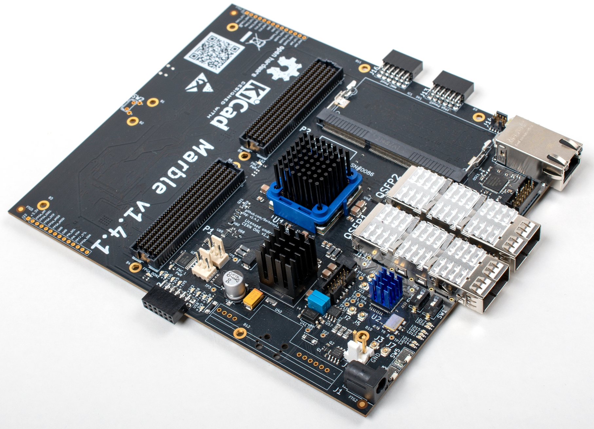

# Marble board

Marble is a dual FMC FPGA carrier board developed for general purpose use in particle accelerator electronics instrumentation. It is currently under development and the base platform for two accelerator projects at DOE: ALS-U (the Advanced Light Source Upgrade at LBNL and the LCLS-II HE (the Linac Coherent Light Source II High Energy upgrade).

The design responds deployment needs in an accelerator environment: reliability, ability to be remotely programmed, safety watchdog, self monitoring, etc. It is intended to be the base digital design for instrumentation electronics, with the capability of connecting to different I/O or analog front ends through the FMC connectors, and is optimized for cost effectiveness for deployments of hundreds of units. It is based on a Network Attached Device (NAD) approach, where high-speed serial links serve as the communication backbone with other systems in the accelerator.

## Basic Idea

## Tools

The Marble design is fully Open Source (licensed under the CERN Open Hardware License v1.2) and designed using Open Source tools (KiCAD).

The schematic/layout tool used is [KiCad EDA](http://www.kicad-pcb.org/)
version 5.1.8; you can feel comfortable using KiCad version 5.1.x, where x &ge; 5.
Other versions will very likely either not read the files
in this repo, or will save files that are not compatible with
collaborators' reference installations.
We also make use of [KiBoM](https://github.com/SchrodingersGat/KiBoM).

See more comments about KiCad versions in [design/scripts/README.md](design/scripts/README.md).

## Major Parts

* U1: Xilinx [XC7K160T-FFG676](https://www.xilinx.com/products/silicon-devices/fpga/kintex-7.html) FPGA
* SK1: 204-pin [DDR3](https://en.wikipedia.org/wiki/DDR3_SDRAM) [SO-DIMM](https://en.wikipedia.org/wiki/SO-DIMM)
* U54: ST [STM32F207VCT6](http://www.st.com/st-web-ui/static/active/en/resource/technical/document/datasheet/CD00237391.pdf) Microcontroller
* U4: Marvell [88E1512](https://www.marvell.com/documents/eoxwrbluvwybgxvagkkf/) Ethernet PHY
* U20: TI [CDCM61004](http://www.ti.com/product/CDCM61004) Clock Generator
* U23: FTDI [FT4232H-56Q](https://www.ftdichip.com/Products/ICs/FT4232H.htm) USB interface
* U35: Maxlinear [XRP7724](https://www.maxlinear.com/product/power-management/universal-pmics/universal-pmics/xrp7724) Quad PWM Power Controller
* Y1: Taitien [TXEAADSANF-25.000000](https://www.taitien.com/wp-content/uploads/2015/12/XO-0076_TX.pdf) 25 MHz VCTCXO

## Auxiliary documentation

25-page schematics like this are a modern reality, but that doesn't mean they
are easy to navigate.  To aid in understanding subsystems that are splattered
over multiple sheets, here are block diagrams that can act as introductions or
indexes to the actual machine-readable and DRC'd schematics.

* I2C subsystems: [marble_i2.eps](docs/marble2_i2c.eps)
* Power Routing: [m_power.eps](docs/m_power.eps)

These are EPS files, authored using [xcircuit](http://opencircuitdesign.com/xcircuit/).
Maybe you want to use GhostView to look at them.

Also see notes on [current measurement capabilities](docs/shunts.md)
at runtime.

Our use of the XRP7724 PWM Power Controller has its own [README](xr_chip/README.md).

## Scripting and processing

See the [scripts subdirectory](design/scripts) for
instructions and helper scripts covering:

* Updating the I2C subsystem diagram in schematics
* Inserting QR code on silkcsreen
* Generating artifacts for manufacturing
* Generating Xilinx constraint file

## Special note about the prototype Marble-Mini

Due to evolving branding ideas, the first prototype run of
[Marble-Mini](https://github.com/BerkeleyLab/Marble-Mini) boards was
marked "Marble v1.0rc3" and the QR code pointed to this Marble repo.
That's a *different board*: 4xSFP instead of 2xQSFP, and no SO-DIMM socket
are the most obvious indicators.
You can go [directly](https://github.com/BerkeleyLab/Marble-Mini/releases/tag/v1.0rc3)
to the documentation related to that manufacturing run.

## Credits

The initial design is supported by the Berkeley Accelerator Controls and Instrumentation (BACI), a DOE High Energy Physics (HEP) General Accelerator R&D (GARD) program and carried out by the Accelerator Technology Group (ATG) at LBNL, in collaboration with the Warsaw University of Technology (WUT) and Creotech Instruments in Poland.

The board was designed by Michal Gaska (WUT) and Larry Doolittle (LBNL) is the mastermind behind the design. Michael Betz, Vamsi Vytla, Sergio Paiagua and Eric Norum (LBNL) have also contributed to the design and supporting software and firmware throughout the development.
