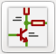

# Marble board scripting and processes

When a new design version of Marble is ready for manufacture, a release is tagged in this repository and the corresponding artifacts are made available for download (e.g. manufacturing package, documentation, etc.). The physical boards have a [QR code](https://en.wikipedia.org/wiki/QR_code) on them, pointing to the board's tagged release on GitHub so a physical board can be mapped to the source code and fabrication package used for its manufacture.

Updating the QR code for a new release, updating the silkscreen design accordingly and generating a fabrication package is a process in itself. That and other processes are partially scripted and documented here.

## Generating the manufacturing package

If you have made changes to the Marble design and are ready to generate the manufacturing package, the first step is to pick a version number for the new release. The current version is `v1.1`.

### Required software

* [KiCad](https://www.kicad.org/): version 5.1.x (x &ge; 5)
* [KiBoM](https://github.com/SchrodingersGat/KiBoM) 1.8.0.

A patch to KiCad is needed in order to support [reproducible](https://reproducible-builds.org) fabrication package builds.
More details on this are available below.

### Update the QR code on the silkscreen

The QR code needs to be re-generated so it points to the new version release. To update the URL, edit the Python script used to generate the QR code image: `design/scripts/qr_create.py`. The URL in that file pointing to the current release is: <https://github.com/BerkeleyLab/Marble/releases/tag/v1.1>.

From the design directory, run the Python script:
```console
$ python scripts/qr_create.py
```
S
Open the KiCad project: `design/Marble.pro`

Open the `Bitmap to Component Converter` clicking on this button at the top of the screen:


Click on `Load Bitmap` and select the `mm_qr.png` that you just generated with the Python script. Choose 400 x 400 DPI to get a 19.8 mm output size. Check the `Negative` and `Front silk screen`, click `Export` and select `logos/QR.kicad_mod` to replace the previous QR code with the new one. You can now close the `Bitmap to Component Converter` and insert the QR code into the silkscreen.

Open the `PCB Layout Editor` clicking on this button at the top of the screen:


Unselect every layer on the right-hand side except for `F.silkS`. If the silkscreen doesn't clearly show up, press `b` on your keyboard.

Select the QR code, right click and select `Update footprint...`. Click `Update` and `Close`.

The Above instructions are tested with KiCad 5.1.8. Be aware of KiCad issue [#6514](https://gitlab.com/kicad/code/kicad/-/issues/6514). If the results look corrupted and you are not able to scan the QR code from the PCB layout editor, select `Modern Toolset (Fallback)` under KiCad Preferences.


This includes Gerbers and BoM files.  See `manufacturing.sh`.
There are two GUI actions that must be performed by hand, before the script can take over.

### Generate the manufacturing package

Now that you have the updated QR code on the silkscreen, we're ready to generate the manufacturing package. The process is summarized in the diagram below.

First, we need to perform two steps using the GUI before we can have a Python script take over and generate the fabrication package:

* Generate the Bill of Materials (BOM): From KiCad, open the `Schematic Layout Editor` clicking on this button at the top of the screen:

 

 Then click on `Tools/ Generate Bill of Materials`. Make sure `Command line:` field is empty, click `Generate` and `Close`.

 * Generate Netlist:

Open the `PCB Layout Editor` clicking on this button at the top of the screen:


Perform a Design Rules Check (DRC). Click on this button in the top menu:


and click on `Run DRC`. Then generate the netlist by clicking on `File / Fabrication Outputs / IPC-D-356 Netlist File...`, click `Save`.

After these steps, we're ready to have the manufacturing script take over and generate the fabrication package.

From the `design` directory, run:

```console
$ bash scripts/manufacturing.sh
```

If everything worked out correctly, the script should have generated the fabrication package in a zipped archive containing the usual manufacturing files for both
PCB fabrication and turn-key assembly:
* Gerber
* Drill
* IPC-D-356
* Board stackup
* BoM
* X-Y placement

The above process is summarized in the diagram below.


## Xilinx constraint file

A somewhat specialized tool is available to create an XDC file for the Marble design,
based on a netlist file exported from KiCad.

From KiCad (version 5.1.x), open the `Schematic Layout Editor` clicking on this button at the top of the screen:

 

* From the top menu, select `Tools / Generate Netlist File`
* Select the `OrcadPCB2 tab`, click on `Generate Netlist` and `Save`. The result shows up as `Marble.net`
* If the above netlist was saved in the `design` directory, from the command line run:
```console
$ python3 scripts/netlist_to_xdc.py Marble.net
```

The result shows up as `Marble.xdc`, which can be used for your FPGA designs.

## Update I2C subsystem diagram in schematics

Run the following command from the top level directory before parting the I2C subsystem diagram into the `I2C_MUX.sch` schematic:
```console
convert docs/marble2_i2c.eps -scale 1330 marble2_i2c.png
```
## Reproducible fabrication package builds

While any KiCad version 5.1.x (x &ge; 5) is likely fine for viewing,
and even editing and artifact-generation, we have taken steps to create
[reproducible](https://reproducible-builds.org) fabrication artifacts.
This means byte-for-byte identical zip files, independent of which person
and computer runs the process.  For this to work, you need
a specially patched version of KiCad 5.1.8.  This

* [patch](72610867-backport.diff)

is backported from the fix to KiCad [Issue #6553](https://gitlab.com/kicad/code/kicad/-/issues/6553).
This process has been tested building from the [source tarball](https://gitlab.com/kicad/code/kicad/-/archive/5.1.8/kicad-5.1.8.tar.gz)
in a [Debian Buster](https://www.debian.org/releases/buster/) [chroot](https://en.wikipedia.org/wiki/Chroot).
If you build KiCad from git sources, you will have to fight the build system to keep the
version string (embedded in the fabrication outputs) from identifying itself as "dirty".
